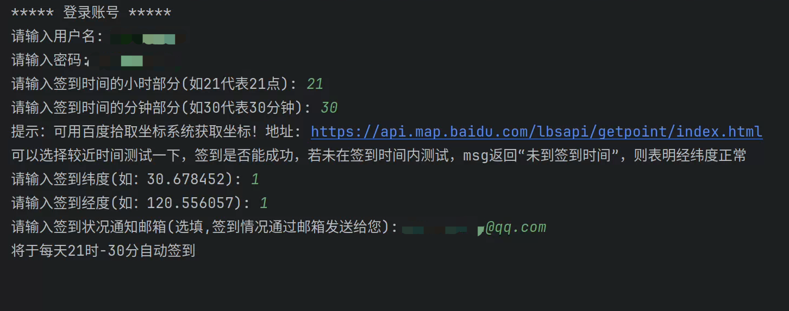
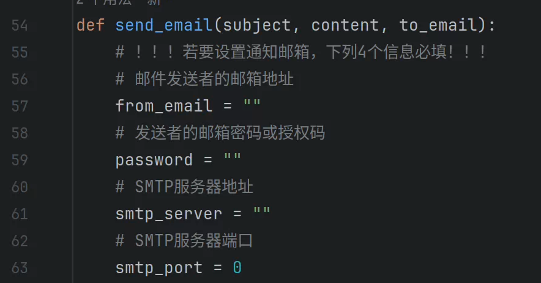

# 安工大自动签到(已测试完毕，可以正常使用)

## 1. 仅供学习使用！！！

## 2. 最好有一台云服务器，运行在服务器中，每天自动签到

## 3. 使用

### 系统内须有python环境，然后下载或复制sign.py代码，然后运行下列指令

```python
pip install apscheduler requests
python3 sign.py
```
### 程序截图：


### 注意! 如果需要邮箱通知签到情况请在代码内设置以下参数,此处设置的是发送者邮箱，即此处的邮箱会在签到后，发送给你一件邮件，可以创建一个备用邮箱填写在下面的地方，4个参数具体在哪获取，请自行搜索
### 拿最常用的qq邮箱举例请看: https://www.ujcms.com/documentation/351.html
